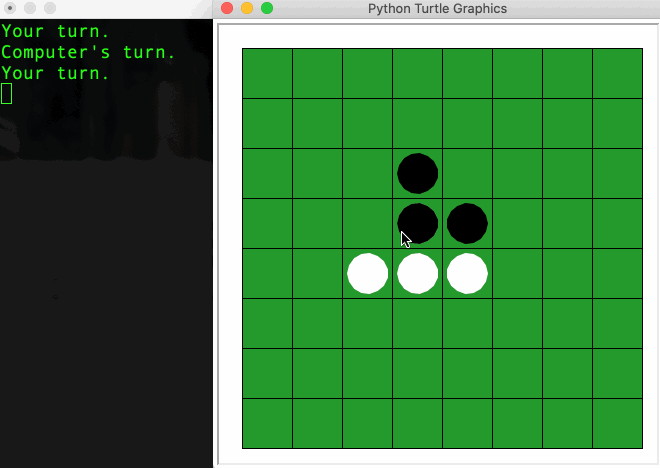

# Othello Game

A simple Python-based version of [Othello game](https://en.wikipedia.org/wiki/Reversi) built with the [turtle library](https://docs.python.org/3.7/library/turtle.html).

## Instructions

Start: `python game.py` (python3 is required for playing the game)

The game is played with black-and-white tiles on an 8x8 board. The object of the game is to have more tiles of your color than your computer opponent has of its. 

- Play begins with 4 tiles in the middle: two white and two black. The user plays the black tile while the computer plays the white tile.
- Black goes first. That player lays down a tile, which must be in a legal position. Any white tiles in between the new black tile and an existing black tile get flipped.
- Play continues, with the players taking turns until the whole board is covered or there are no more legal moves.
- When the board is completely covered in tiles, or there are no more legal moves, then the game is over. Whichever player has more tiles of their color on the board wins. The program will announce the winner and how many tiles they have on the board. Ties can happen, too.

**Legal moves**: for a move to be legal, a tile must be placed such that at least one opposing tile will be flipped.

## File structure

- `board.py`: contains a class that represents the game board.
- `game.py`: the main entry port for the game.
- `othello.py`: contains a class that represents the game logic.
- `othello_test.py` contains unit tests for the game.
- `score.py`: contains score-related functions for the game.
- `test_*.txt`: test files for the unit tests.

## Disclaimer

This is a personal project for *CS5001 Intensive Foundations of Computer Science* and a Git repository was not used originally. For maintaining academic integrity, please do NOT reuse any code in this repository if you are working on your project for a related course.

(defrule guess-move-random
   ?t <- (time (step ?s))
   (cell (step ?s) (row ?r) (col ?c) (content empty))
=>
   (bind ?s3 (+ ?s 1))
   (assert (move (step ?s3) (row ?r) (col ?c)))
   (modify ?t (step ?s))
) 